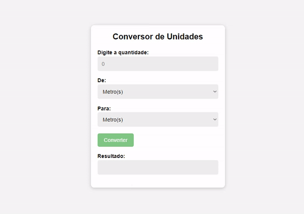

# Conversor de Unidades

Projeto desenvolvido em HTML,CSS e Java Script. O site desenvolvido é um conversor de medidas.

🔗 [Click here to access](https://n4ju15.github.io/conversor_unidades/)

## Tecnologias

- HTML
- CSS
- JavaScript
- Git and Github
